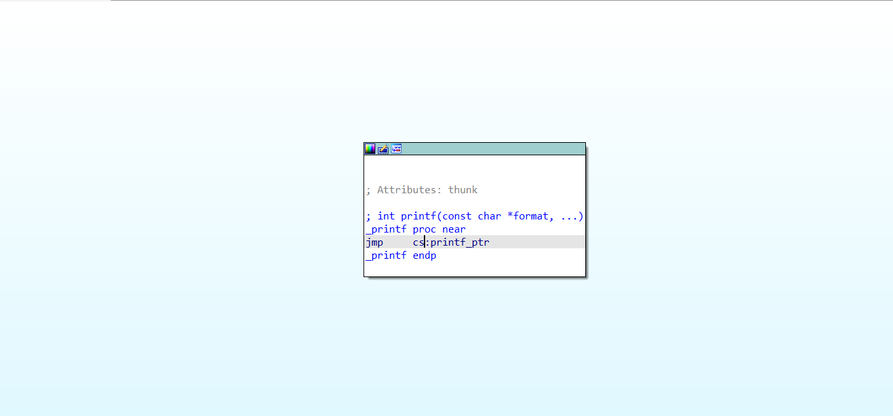

# 😉 工具介绍

## 1.upx脱壳工具

upx不仅可以拿来脱壳，也可以拿来加壳。这里使用win11作为实验

### ①进入upx

<figure><figcaption></figcaption></figure>

我们在此目录下开启终端，然后键入，

```
.\upx.exe -h
```

<figure><figcaption></figcaption></figure>

如果出现这个界面，就说明安装成功。

### ②脱壳

```
 .\upx.exe -d 文件路径
```

<figure><figcaption></figcaption></figure>

出现Unpacked 1 file.就是成功了，然后这个文件直接就被脱壳了。

### ③加壳

```
upx 文件路径
```

这里就不演示了，因为一般都是解壳。


## 2.IDA pro

### Ⅰ常用快捷键：

#### ①fn+F5：切换伪C代码

<figure><figcaption></figcaption></figure>

<figure><figcaption></figcaption></figure>

#### ②后退：ESC

#### ③Tab：汇编和伪代码互换

<figure><figcaption></figcaption></figure>

<figure><figcaption></figcaption></figure>

#### ④n：重命名

用鼠标点击某个函数或者变量之后，按照n，可以理解为name

<figure><figcaption></figcaption></figure>


#### ⑤y：设置类型

其实就是更改c语言的形参，比如某些时候有一个转伪代码时候识别不正确，就要用y更改。

<figure><figcaption></figcaption></figure>


#### ⑥h：数字类型的转换，比如16进制和10进制

<figure><figcaption></figcaption></figure>

<figure><figcaption></figcaption></figure>


#### ⑦r：ascii码和数字转换

和上面同理


#### ⑧x:交叉引用

就是看在哪里引用了这些，比如函数啊，变量啊之类的。

<figure><figcaption></figcaption></figure>

#### ⑨：xref graph to

但是交叉引用只能看在选中位置外层的，不是内层的，所以如果要看全局的话需要到图形化的汇编码页面选择xref graph to去看

<figure><figcaption></figcaption></figure>

<figure><figcaption></figcaption></figure>


